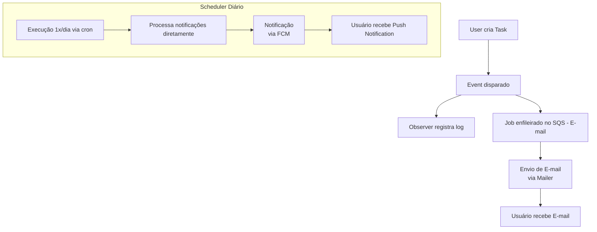

# Projeto Laravel 12 – Task Manager

## Descrição

Este projeto é uma API desenvolvida em **Laravel 12**, seguindo **Clean Architecture** e princípios **SOLID**.
Ele gerencia **Tasks** e **Users**, com foco em **notificações agendadas**, **envio de e-mails assíncronos**, integração com **AWS** e comunicação com **microserviços externos**.

## Funcionalidades

* CRUD completo de **Tasks** e **Users**
* Relacionamento **N:N** entre Users e Tasks
* Sistema de **prioridades** e **farol de entrega**
* **Logs automáticos** de criação, atualização e exclusão via **Observers**
* Autenticação e autorização via **JWT**
* Integração com **AWS S3, SQS e CloudWatch (via Terraform)**
* **Notificações push via Firebase Cloud Messaging (FCM)** disparadas **uma vez por dia via Laravel Schedule (sem fila)**
* **Envio de e-mails assíncronos via SQS** na criação de Tasks
* Filtros avançados e paginação nos endpoints
* Testes **unitários e de feature** com PHPUnit
* **Husky hooks** para garantir qualidade antes de commits e push

## Arquitetura e Padrões

* **Clean Architecture**
* **SOLID**
* **Events & Listeners** → eventos de domínio (ex: criação de Task)
* **Jobs** → processamento assíncrono em filas (SQS)
* **Observers** → logs automáticos em Task
* **Factories** → criação de dados de teste
* **Strategy** → regras de prioridade e farol de entrega
* **Schedule (Scheduler)** → processamento **agendado (1 vez por dia)** de notificações push **sem uso de filas**

## Logs e Monitoramento

* Logs de criação, atualização e exclusão de tasks via **Observers**
* Centralização de logs no **AWS CloudWatch**
* Notificações push processadas pelo **Scheduler diário** (sem fila)
* Envio de e-mails assíncronos via **SQS**

## Integrações Externas

* **Vue.js (SPA Frontend)** → Consome diretamente a API Laravel
* **LangChain + FastAPI (Python Microservice)** → Análise de desempenho do usuário

  * Comunicação **direta entre Vue.js e FastAPI**
  * Laravel não tem conhecimento desse microserviço

## Fluxo de Notificações e E-mails (Mermaid)



## Testes

* **Unitários** → regras de negócio e serviços
* **Feature** → endpoints e fluxo completo de APIs

## Husky – Pre-commit e Pre-push

### `.husky/pre-commit`

```bash
#!/bin/sh
set -e

echo "🖌️  Iniciando Pint..."
./vendor/bin/pint
echo "✅ Pint finalizado!"
```

### `.husky/pre-push`

```bash
#!/bin/sh
set -e

echo "🧪 Iniciando PHPUnit..."
./vendor/bin/phpunit
echo "✅ PHPUnit finalizado!"
